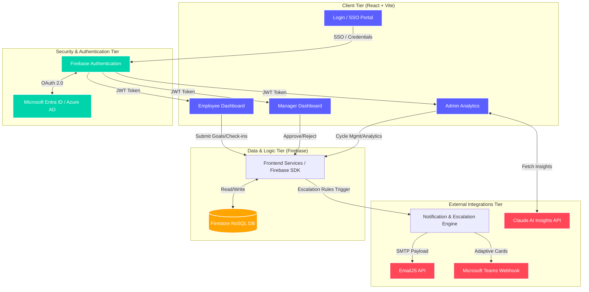

# Architecture Diagram: Nexus Performance Platform

This document contains the Mermaid.js representation of the Nexus architecture. 
**To generate a PDF or Image:** You can view this file natively in GitHub (which renders Mermaid automatically) and take a screenshot, or use a tool like [Mermaid Live Editor](https://mermaid.live/) to export it as a PNG/PDF.

### Component Breakdown
1. **Client Tier**: The front-end application built in React. Handles rendering of the dashboards based on RBAC (Role-Based Access Control).
2. **Security Tier**: Firebase Auth acts as the primary gatekeeper, federating identity to Microsoft Entra ID for Enterprise Single Sign-On (SSO).
3. **Data & Logic Tier (Serverless BaaS)**: The system is completely serverless. Instead of hosting a traditional Node.js/Express or Python backend server, the client communicates directly with Cloud Firestore using the Firebase Web SDK. This provides direct-to-database real-time performance, ensures zero server maintenance overhead, and guarantees cost efficiency.
4. **Integration Tier**: The Notification engine broadcasts escalation events out to Email and Microsoft Teams simultaneously.
