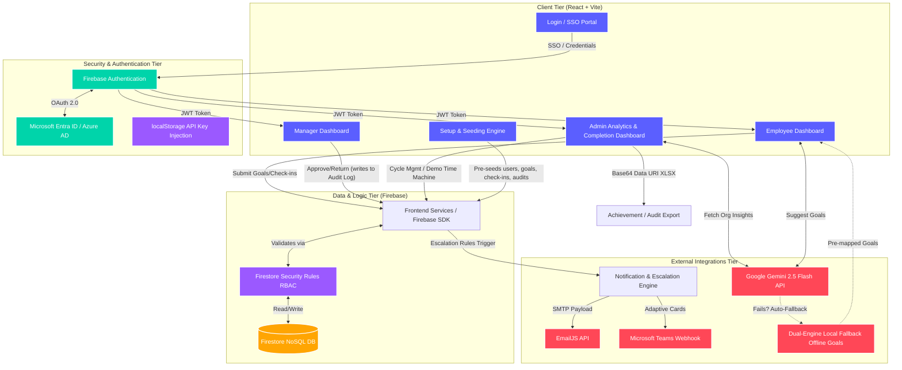

# Architecture Diagram: Nexus Performance Platform

This document contains the Mermaid.js representation of the Nexus architecture. 
**To generate a PDF or Image:** You can view this file natively in GitHub (which renders Mermaid automatically) and take a screenshot, or use a tool like [Mermaid Live Editor](https://mermaid.live/) to export it as a PNG/PDF.

### Component Breakdown
1. **Client Tier**: The front-end application built in React. Handles rendering of the dashboards based on RBAC (Role-Based Access Control). Incorporates a Setup Engine to pre-seed comprehensive test data (including Q1 check-ins and audit logs) to avoid cold-load analytics states.
2. **Security & Authentication Tier**: Firebase Auth acts as the primary gatekeeper, federating identity to Microsoft Entra ID for Enterprise Single Sign-On (SSO). Includes a secure localStorage mechanism to inject the Gemini API key during hackathon demos without committing secrets to Git.
3. **Data & Logic Tier (Serverless BaaS)**: The system is completely serverless. The client communicates directly with Cloud Firestore using the Firebase Web SDK. Strict **Firestore Security Rules** enforce role-based access policies (Admin/Manager/Employee isolation) at the database layer. An embedded "Demo Time Machine" allows admins to instantly warp global timestamps to test cycle transitions.
4. **Integration Tier**: 
   - **Google Gemini 2.5 Flash**: Real-time AI goal and strategy generation with a robust **Dual-Engine Local Fallback** that guarantees a crash-proof demo if the API rate limits or network fails.
   - **Notification Engine**: Broadcasts escalation events out to Email and Microsoft Teams simultaneously.
5. **Data Export**: Generates raw Excel (`.xlsx`) compliance exports (Achievement Reports and full Audit Trails) directly in the browser via Base64 Data URIs, completely avoiding server-side blob generation.
